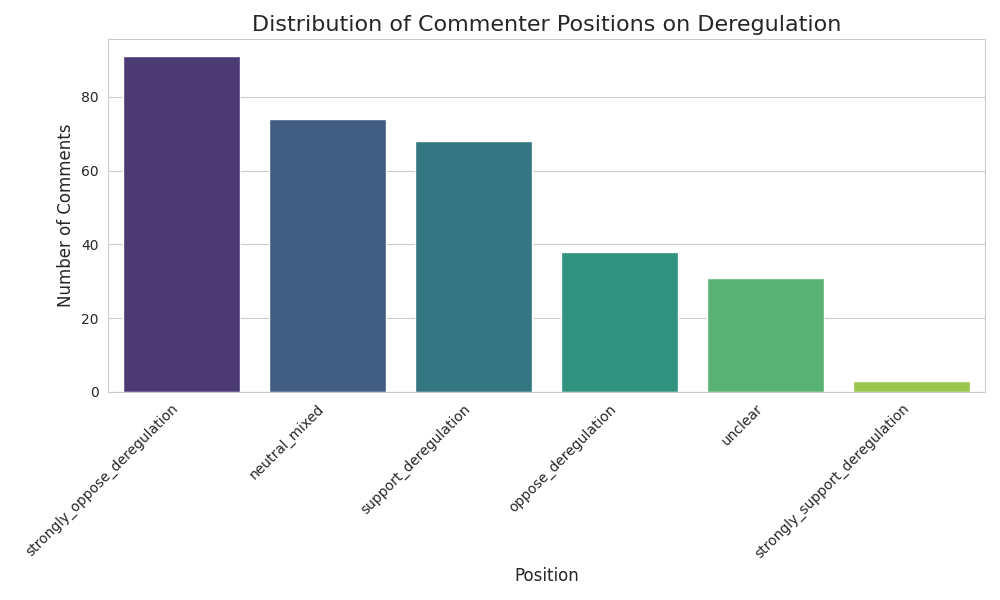
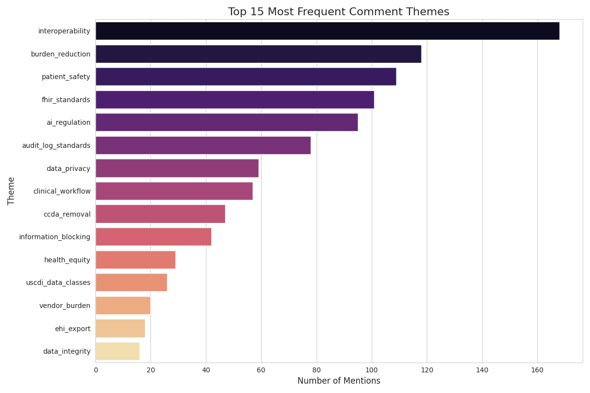
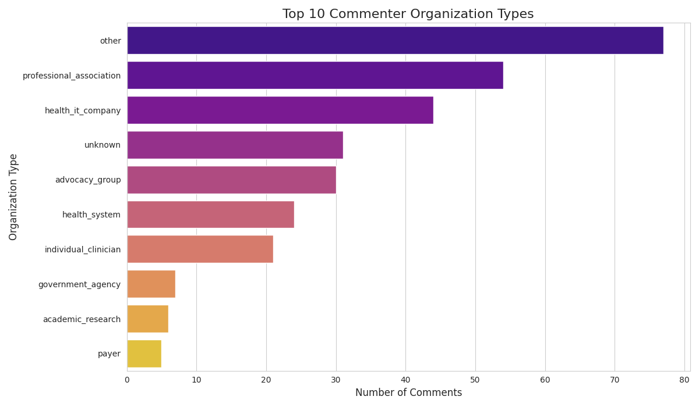

# Analysis of Public Comments on the HTI-5 Proposed Rule

## Health Data, Technology, and Interoperability: ASTP/ONC Deregulatory Actions to Unleash Prosperity

**Document Reference:** HHS-ONC-2025-0005-0001  
**Comment Period Closed:** February 27, 2026  
**Analysis Date:** March 2, 2026  
**Prepared by:** Manus AI

---

## Table of Contents

1. [Executive Summary](#executive-summary)
2. [Background and Context](#background-and-context)
3. [Comment Landscape Overview](#comment-landscape-overview)
4. [Thematic Analysis](#thematic-analysis)
   - [Theme 1: Audit Log Standards and Security Certification](#theme-1-audit-log-standards-and-security-certification)
   - [Theme 2: FHIR and Interoperability Standards](#theme-2-fhir-and-interoperability-standards)
   - [Theme 3: C-CDA Removal and Document Exchange](#theme-3-c-cda-removal-and-document-exchange)
   - [Theme 4: USCDI Data Standards and Health Equity](#theme-4-uscdi-data-standards-and-health-equity)
   - [Theme 5: EHI Export and Patient Data Access](#theme-5-ehi-export-and-patient-data-access)
   - [Theme 6: Regulatory Burden Reduction](#theme-6-regulatory-burden-reduction)
   - [Theme 7: Patient Safety and Care Quality](#theme-7-patient-safety-and-care-quality)
5. [Stakeholder Perspectives by Organization Type](#stakeholder-perspectives-by-organization-type)
6. [Notable Voices and Representative Quotes](#notable-voices-and-representative-quotes)
7. [Strategic Recommendations](#strategic-recommendations)
8. [Conclusion](#conclusion)

---

## Executive Summary

This report presents a comprehensive analysis of all 305 public comments submitted in response to the HTI-5 proposed rule — formally titled "Health Data, Technology, and Interoperability: ASTP/ONC Deregulatory Actions to Unleash Prosperity" — published by the Assistant Secretary for Technology Policy/Office of the National Coordinator for Health Information Technology (ASTP/ONC). The comment period closed on February 27, 2026.

The proposed rule seeks to remove or reduce a number of health IT certification requirements, including the Consolidated CDA (C-CDA) creation criterion, audit log standards, electronic health information (EHI) export requirements, and certain AI transparency mandates. The stated rationale is to reduce regulatory burden on health IT developers and align with a broader deregulatory agenda.

The analysis reveals a **strongly mixed-to-negative public response**, with a weighted average sentiment score of **-0.81** on a scale from -3 (strongly oppose) to +3 (strongly support). The position distribution is as follows:

| Position                      | Count | Percentage |
| ----------------------------- | ----- | ---------- |
| Strongly Oppose Deregulation  | 91    | 29.8%      |
| Neutral / Mixed               | 74    | 24.3%      |
| Support Deregulation          | 68    | 22.3%      |
| Oppose Deregulation           | 38    | 12.5%      |
| Unclear / No Position         | 31    | 10.2%      |
| Strongly Support Deregulation | 3     | 1.0%       |

A clear plurality — **42.3% of all commenters** — oppose or strongly oppose the proposed deregulatory actions. Only 23.3% express support or strong support. The remaining third are either neutral, mixed, or did not take a clear position.

The most frequently cited concerns center on seven major themes: audit log and security standards (168 mentions of interoperability as a theme), FHIR and interoperability standards (101 mentions), C-CDA removal (47 mentions), USCDI data classes (26 mentions), EHI export requirements (18 mentions), regulatory burden reduction (118 mentions), and patient safety (109 mentions).

**Key findings:**

- **Individual clinicians are overwhelmingly opposed**: 19 of 21 individual clinician commenters (90.5%) oppose or strongly oppose the proposed rule, citing patient safety, usability, and clinical workflow concerns.
- **Health IT companies are the primary supporters**: 24 of 44 health IT company commenters (54.5%) support or strongly support the deregulatory actions, primarily citing compliance cost reduction and FHIR modernization.
- **Professional associations are deeply divided**: Of 54 professional association comments, 22 oppose or strongly oppose, 15 support, and 17 are neutral/mixed — reflecting genuine disagreement within the organized health care community.
- **The audit log debate is the most contested issue**: 138 comments touch on audit log standards, with strong arguments on both sides regarding the sequencing of modernization versus deregulation.
- **AI transparency is a cross-cutting concern**: 95 comments raise AI regulation themes, with the majority calling for retention or strengthening of transparency and governance requirements.

---

## Background and Context

The HTI-5 proposed rule represents a significant departure from the regulatory trajectory established by the 21st Century Cures Act and its implementing rules (HTI-1 and HTI-2). Where prior rules expanded certification requirements to strengthen interoperability, data access, and algorithmic transparency, HTI-5 proposes to roll back many of these requirements under the banner of deregulation and burden reduction.

The specific provisions proposed for removal or reduction include:

- **§170.315(g)(6)** — Consolidated CDA (C-CDA) creation certification criterion
- **§170.315(d)(2)** and related — Audit log and data preservation standards
- **§170.315(g)(10)** — Standardized API for patient and population services
- **USCDI data classes** — Proposed reduction from v3 to a narrower set
- **AI/CDS transparency requirements** — Removal of model card and governance mandates
- **EHI export requirements** — Modification of scope and definitions
- **Privacy and security certification criteria** — Proposed removal of several criteria

The proposed rule was published during a period of significant federal deregulatory activity, and many commenters explicitly referenced the broader political context in their submissions.

---

## Comment Landscape Overview

The 305 comments were submitted by a diverse range of stakeholders. Of these, 259 contained substantive text (either inline or via PDF attachment), representing 3.45 million characters of analyzed content. The remaining 46 were either blank, contained only "see attached" with no retrievable attachment, or were otherwise non-substantive.

The top 15 themes by frequency of mention across all comments are shown above. Interoperability (168 mentions), burden reduction (118 mentions), and patient safety (109 mentions) are the three most pervasive themes — reflecting the fundamental tension at the heart of this rulemaking between the desire to reduce compliance costs and the imperative to maintain standards that protect patients and enable data exchange.

---

## Thematic Analysis

### Theme 1: Audit Log Standards and Security Certification

**138 comments** touched on audit log standards, making this the most contested single theme in the rulemaking. The proposed removal or reduction of certification criteria related to audit logs, data preservation, and privacy/security generated both strong support from health IT vendors seeking compliance relief and fierce opposition from clinicians, patient advocates, and legal professionals.

**The case for deregulation** rests primarily on the argument that current audit log certification requirements are outdated, costly, and do not effectively improve interoperability or patient safety in practice. Proponents, led primarily by health IT companies such as IRIS Health Solutions, argue that API-first, modular integration architectures better serve modern health care workflows and that removing prescriptive certification criteria would free developers to build more effective, real-world solutions. They further argue that clarifying automated system-to-system access under information blocking rules would reduce unintentional violations and align policy with how modern health IT systems actually operate.

**The case against deregulation** is substantially stronger in terms of volume and intensity. Opponents argue that current audit trail standards are already insufficient for modern clinical environments — particularly given the rapid proliferation of AI-driven clinical decision support tools and connected medical devices — and that removing them before updating them to address these new realities would create a dangerous accountability gap. The Public Policy Resilience Institute (PPRi) submitted a detailed analysis arguing that audit trails must be modernized to explicitly capture AI and device activities, granular metadata, and durable data retention policies before any deregulatory actions proceed. Individual clinician Nursine Jackson argued that "the integrity of a medical record is only as reliable as its audit trail," a sentiment echoed by dozens of other commenters.

The Alliance for Nursing Informatics warned that "removing privacy and security criteria transfers the onus to health care organizations lacking security infrastructure," highlighting the concern that deregulation would disproportionately burden smaller, under-resourced providers. The California Department of Justice submitted a comment specifically opposing the removal of security certification criteria, citing the state's interest in protecting patient data from breaches and unauthorized access.

**Key tensions in this theme:**

The most significant tension is one of sequencing: should ONC deregulate first and allow the market to develop better solutions, or should it update and modernize the standards before removing the existing ones? The majority of commenters favor the latter approach, arguing that removing guardrails before the new road is built creates unacceptable risks.

**Top recommendations from commenters:**

- Prioritize revision and modernization of audit trail standards before deregulating certification requirements
- Implement explicit, enforceable, and testable assurance floors if privacy/security certification criteria are removed
- Include explicit capture of AI, medical device, and messaging activities in audit trails with granular metadata
- Pause proposed certification changes until robust audit and preservation standards are finalized
- Provide clear guidance affirming automated system-to-system access under information blocking rules

---

### Theme 2: FHIR and Interoperability Standards

**57 comments** addressed FHIR and interoperability standards, with a notably more balanced distribution of positions than the audit log theme. Health IT companies largely support the FHIR-forward direction of the proposed rule, while clinicians and some professional associations express concern that deregulation could undermine the enforcement mechanisms needed to make interoperability real.

The dominant sentiment is one of **cautious support for FHIR modernization paired with strong insistence on maintaining enforcement**. Commenters broadly agree that FHIR represents the future of health IT interoperability and that the US should align with global standards. However, they diverge sharply on whether removing certification requirements is the right way to accelerate FHIR adoption.

WENO Exchange LLC, a health IT company focused on pharmacy interoperability, submitted a detailed comment arguing for stricter enforcement against pharmacy information blocking — a notable case of a health IT company calling for _more_ regulation in a specific area even while supporting the broader deregulatory agenda. Trilogy Innovation, Inc. strongly supported the deregulatory actions, arguing that FHIR-based APIs have matured sufficiently to replace legacy certification requirements.

On the other side, Raymond Blair, an individual clinician, urged caution to preserve interoperability guardrails, noting that "interoperability must remain a non-negotiable foundation of the health IT ecosystem." Orion Health (a HEALWELL Company) submitted a comment stating that "interoperability must remain a non-negotiable foundation of the health IT ecosystem." The Association of Public Health Laboratories argued that "standards are not bureaucratic obstacles; they are the foundation of true interoperability."

**Key tensions in this theme:**

- Balancing deregulation to reduce certification burden with the need to maintain enforceable interoperability standards
- Ensuring that deregulation does not shift compliance burdens from vendors to providers or ACOs
- Determining appropriate accountability for pharmacies and delegated entities in adopting FHIR APIs
- Aligning modernization of interoperability regulations with updates to HIPAA and Stark Law

**Top recommendations from commenters:**

- Reinforce API-first interoperability as the primary policy objective
- Maintain or strengthen information blocking enforcement, particularly for pharmacies
- Provide clear guidance on automated system-to-system access
- Align interoperability modernization with updates to related legal frameworks

---

### Theme 3: C-CDA Removal and Document Exchange

**31 comments** specifically addressed the proposed removal of the Consolidated CDA (C-CDA) creation certification criterion under §170.315(g)(6). This theme generated a nearly even split between supporters and opponents, reflecting genuine disagreement about the readiness of the health care ecosystem to transition fully to FHIR-based document exchange.

**Opponents of removal** argue that C-CDA documents provide a clearer, more accessible, and more comprehensive summary of clinical events than segmented FHIR resources, particularly for patients and caregivers who are not technically sophisticated. Debi Willis, an individual commenter, argued that "consolidated documents are easier for patients and caregivers to understand and share, containing valuable information not found elsewhere." HLN Consulting, LLC, a health IT company focused on public health, argued that public health agencies rely on existing standards like CDA and HL7 v2.5.1 and are not yet ready for widespread FHIR adoption, warning that removing certification criteria prematurely would increase variability and burden on public health entities.

**Supporters of removal** argue that FHIR Clinical Documents represent the future standard and that the US should accelerate its transition to align with global interoperability trends. David Rocha, a prolific commenter who submitted multiple detailed comments, strongly supported the shift to FHIR, arguing that "electronic PDFs, faxes, electronic faxes, JPEGs, and TIFs shall never substitute for standards-based electronic transactions or structured EHI exchange." InterSystems Corporation supported the FHIR shift but urged maintaining a baseline end-to-end transitions-of-care capability during the transition period.

**Key tensions in this theme:**

- Balancing innovation through FHIR adoption against the need for stability provided by C-CDA documents
- The readiness of public health agencies and health care organizations to adopt FHIR
- Ensuring patient and caregiver access to clear, consolidated clinical information
- Aligning US health IT certification with global interoperability trends

**Top recommendations from commenters:**

- Reconsider and retain the C-CDA creation certification criterion in §170.315(g)(6)
- If proceeding with removal, accelerate the transition timeline with funding and support for implementers
- Maintain support for CDA and HL7 v2.5.1 until public health agencies are ready for FHIR
- Adopt higher versions of USCDI (v4 or v6) in certification to ensure comprehensive patient demographic data

---

### Theme 4: USCDI Data Standards and Health Equity

**13 comments** specifically addressed USCDI data standards and classes, though the themes of health equity and data standards permeated many other comments. The dominant sentiment is one of **cautious opposition to reducing USCDI requirements**, with particular concern about the impact on vulnerable populations.

Rocky Mountain Equality, an LGBTQ+ advocacy organization, submitted a detailed comment arguing that removing or reducing data requirements for sexual orientation, gender identity, and pronouns would harm LGBTQ+ patients by making it harder for providers to deliver culturally competent care. The Family Caregiver Alliance argued for the inclusion of standardized caregiver data elements, noting that caregiver identification and strain assessments are essential for caregiver-inclusive care coordination.

The Physical Activity Alliance submitted a comment urging ONC to adopt USCDI v4 rather than v3.1, specifically to include physical activity assessment data that aligns with CMS and CMMI policies promoting prevention and lifestyle-based care. The American Medical Association took a nuanced position, supporting burden reduction to foster innovation in AI-driven decision support tools, but strongly advocating for retaining transparency, governance, and risk management requirements for high-risk AI applications.

**Top recommendations from commenters:**

- Maintain regulatory requirements for LGBTQ+-relevant data fields including sexual orientation, gender identity, and pronouns
- Retain AI model card transparency, governance, auditability, and change control requirements for high-risk predictive decision support
- Adopt USCDI version 4 instead of v3.1 to include physical activity assessment data
- Include standardized caregiver data elements in FHIR API scope and future USCDI versions
- Implement a two-tiered risk framework for AI tools with lighter requirements for low-risk applications

---

### Theme 5: EHI Export and Patient Data Access

**3 comments** specifically addressed EHI export requirements, though the broader themes of patient data access and information blocking appeared in many more. The small number of comments on this specific provision reflects its relative technical complexity, but the comments received were substantive and represent important stakeholder perspectives.

Middlesex Health, a health system, expressed support for the proposed revisions to explicitly include automation technologies in the definitions of "access" and "use" of EHI, arguing that regulatory clarity would reduce ambiguity, encourage investment, and accelerate AI adoption. The American College of Obstetricians and Gynecologists (ACOG) strongly opposed the proposed expansions, citing the vulnerabilities of sensitive patient populations — particularly survivors of intimate partner violence, adolescents, and pregnant individuals with substance use disorders — and warning that current EHR systems lack adequate capabilities to segment sensitive data. George Wise, an attorney representing victims of medical negligence, argued that deregulation could hinder access to complete medical records, thereby disadvantaging victims and potentially benefiting wrongdoers.

**Key tensions in this theme:**

- Balancing the promotion of innovation and AI adoption with the need to protect sensitive patient data
- Ensuring regulatory clarity while preventing exploitation of exceptions like the Manner Exception
- Protecting vulnerable populations' confidentiality while enabling broader automated access

---

### Theme 6: Regulatory Burden Reduction

**11 comments** specifically focused on regulatory burden reduction as their primary theme, though burden reduction arguments appeared in many more comments across all themes. The position distribution here is notably mixed, with opponents of deregulation actually outnumbering supporters even on this theme — suggesting that many commenters who acknowledge the burden problem nonetheless oppose the specific approach taken in HTI-5.

SLI Compliance, a health IT consulting firm, supported streamlined reporting and regulatory clarifications, arguing that requiring developers to submit Real World Test Results Reports containing redundant information adds cost without value. MedStar Health, a large health system, took a more cautious position, urging retention of usability testing safeguards while acknowledging the need to reduce compliance costs. The College of American Pathologists (CAP) submitted a detailed comment balancing burden reduction with patient safety and AI transparency, proposing a risk-based framework that would allow lighter requirements for low-risk applications while maintaining full requirements for high-risk tools.

Lauge Sokol-Hessner, an individual clinician, submitted a particularly notable comment arguing that "EHR usability is not an abstract concern; it is a patient safety issue," and warning that deregulation of usability requirements could have direct clinical consequences.

---

### Theme 7: Patient Safety and Care Quality

**5 comments** specifically focused on patient safety as their primary theme, though patient safety concerns permeated virtually every other theme in the analysis. The position distribution is strongly opposed to deregulation: 3 strongly oppose, 1 opposes, and 1 supports.

The Moses Firm, an Atlanta-based law firm representing patients in medical malpractice cases, submitted a comment arguing that the proposed deregulatory actions would harm patients' ability to access their medical records and hold providers accountable for errors. The California Department of Justice submitted a comment specifically opposing the removal of security certification criteria, citing the state's interest in protecting patient data. Owen Belamaric submitted a comment raising concerns about AI in health care, noting that "it is a text generator which makes sense more often than not, not a thinking machine" — a pointed critique of the risks of over-relying on AI tools without adequate transparency requirements.

Fairview Health Services identified what it called "the most dangerous elements from this proposed deregulation": loss of AI transparency artifacts, erosion of clinical decision support (CDS) governance, and the removal of audit trail requirements.

---

## Stakeholder Perspectives by Organization Type

The following table summarizes the position distribution by organization type, revealing important patterns in how different segments of the health care community view the proposed rule:

| Organization Type         | Count | Strongly Support | Support | Neutral/Mixed | Oppose | Strongly Oppose |
| ------------------------- | ----- | ---------------- | ------- | ------------- | ------ | --------------- |
| Health IT Companies       | 44    | 2                | 22      | 14            | 1      | 5               |
| Professional Associations | 54    | 0                | 15      | 17            | 17     | 5               |
| Health Systems            | 24    | 0                | 5       | 14            | 3      | 2               |
| Individual Clinicians     | 21    | 0                | 1       | 1             | 4      | 15              |
| Advocacy Groups           | 30    | 0                | 7       | 3             | 5      | 15              |
| Government Agencies       | 7     | 0                | 1       | 3             | 2      | 1               |
| Academic/Research         | 6     | 0                | 2       | 3             | 1      | 0               |
| Payers                    | 5     | 0                | 2       | 2             | 0      | 1               |

Several patterns stand out from this analysis:

**Health IT companies are the primary supporters of deregulation.** Of 44 health IT company comments, 24 (54.5%) support or strongly support the proposed actions, compared to only 6 (13.6%) who oppose or strongly oppose. This reflects the direct financial interest health IT vendors have in reducing certification compliance costs.

**Individual clinicians are overwhelmingly opposed.** Of 21 individual clinician comments, 19 (90.5%) oppose or strongly oppose the proposed rule. This is the most lopsided distribution of any stakeholder group and reflects deep concern about the clinical implications of removing standards that directly affect the tools clinicians use every day.

**Professional associations are deeply divided.** Of 54 professional association comments, 22 (40.7%) oppose or strongly oppose, 15 (27.8%) support, and 17 (31.5%) are neutral or mixed. This division reflects the heterogeneity of the professional association community, which includes both technology-forward organizations that support FHIR modernization and clinician-focused organizations that prioritize patient safety.

**Health systems are cautiously neutral.** Of 24 health system comments, 14 (58.3%) are neutral or mixed, reflecting the complex position health systems occupy as both consumers of health IT products (who benefit from reduced vendor costs) and providers of care (who depend on reliable, standardized data exchange).

**Advocacy groups strongly oppose deregulation.** Of 30 advocacy group comments, 20 (66.7%) oppose or strongly oppose the proposed rule, with particular concern about health equity, patient safety, and the protection of vulnerable populations.

---

## Notable Voices and Representative Quotes

The following quotes, drawn from the public record, capture the range of perspectives expressed in the comment corpus:

> "The integrity of a medical record is only as reliable as its audit trail." — Jennifer Matyac

> "Removing the guardrails before the new road is built is not reform. It is an open invitation." — Susan Petersen

> "EHR usability is not an abstract concern; it is a patient safety issue." — Lauge Sokol-Hessner, MD

> "Standards are not bureaucratic obstacles; they are the foundation of true interoperability." — Association of Public Health Laboratories

> "Interoperability must remain a non-negotiable foundation of the health IT ecosystem." — Orion Health (a HEALWELL Company)

> "Removing privacy and security criteria transfers the onus to health care organizations lacking security infrastructure." — Alliance for Nursing Informatics

> "The proposed rule would hurt victims of medical negligence and help the wrongdoers who commit malpractice." — George Wise, Attorney

> "Modernization must proceed in a way that preserves patient safety, public health continuity, and equity." — Chloe Watts

> "Audit trails are essential to billing integrity, patient trust, and legal accountability." — Craig Tuttle

> "Health IT policies developed primarily for acute care often fail to account for unique LTPAC characteristics." — American Health Care Association/National Center for Assisted Living

> "The most dangerous elements from this proposed deregulation are: loss of AI transparency artifacts, erosion of CDS, and removal of audit trail requirements." — Fairview Health Services

> "Certain deregulatory actions — particularly removal of AI transparency mandates and privacy/security criteria — create governance vacuums that undermine trust in health IT systems." — Satyadhar Joshi

---

## Strategic Recommendations

Based on the comprehensive analysis of all 305 public comments, the following strategic recommendations are offered. These recommendations are framed, where applicable, in terms of what can be achieved through **subregulatory guidance** (such as policy statements, technical standards, and implementation guidance) rather than requiring changes to the final rule itself — recognizing the legal constraint that the final rule cannot incorporate concepts not proposed in the original NPRM.

### Recommendation 1: Pause or Substantially Revise the Removal of Audit Log and Security Certification Criteria

The volume and intensity of opposition to the removal of audit log and security certification criteria is the strongest signal in the entire comment corpus. The dominant concern is not that these standards are perfect — commenters broadly acknowledge they need modernization — but that removing them before updating them creates an accountability vacuum that could harm patients and undermine trust in health IT systems.

ONC should either pause the proposed removal of these criteria pending the development of updated standards, or commit to a concurrent rulemaking that would replace the removed criteria with modernized equivalents. At minimum, ONC should issue subregulatory guidance establishing enforceable assurance floors for privacy, security, and auditability in the absence of certification criteria.

### Recommendation 2: Adopt a Phased Transition for C-CDA Removal with Clear Milestones

The debate over C-CDA removal reflects a genuine disagreement about ecosystem readiness, not a fundamental disagreement about the direction of travel. Most commenters — even those who oppose immediate removal — agree that FHIR Clinical Documents represent the future of health IT document exchange. The question is one of timing and support.

ONC should consider a phased transition approach that sets a clear sunset date for C-CDA certification requirements (e.g., 3-5 years) while simultaneously providing funding, technical assistance, and implementation guidance to help public health agencies, smaller providers, and other stakeholders prepare for the transition. This approach would honor the deregulatory intent of the rule while addressing the legitimate readiness concerns raised by commenters.

### Recommendation 3: Retain and Strengthen AI Transparency Requirements

The 95 comments that raised AI regulation themes are nearly unanimous in calling for the retention or strengthening of AI transparency and governance requirements. The American Medical Association, the College of American Pathologists, Fairview Health Services, and numerous other commenters argue that removing AI transparency mandates at this stage of AI adoption in health care would be premature and potentially dangerous.

ONC should retain the AI model card, governance, and auditability requirements for high-risk clinical decision support tools. If burden reduction is a priority, ONC could implement a risk-based, tiered framework — as proposed by the AMA and CAP — that applies lighter requirements to low-risk applications while maintaining full requirements for high-risk tools. This approach could be implemented through subregulatory guidance without requiring changes to the final rule.

### Recommendation 4: Protect USCDI Data Classes for Vulnerable Populations

The comments from Rocky Mountain Equality, the Family Caregiver Alliance, and the Physical Activity Alliance highlight the specific harm that could result from reducing USCDI data requirements for vulnerable populations. ONC should retain data elements related to sexual orientation, gender identity, caregiver information, and physical activity, and should consider adopting USCDI v4 rather than v3.1 to ensure that the certification framework keeps pace with evolving care delivery models.

### Recommendation 5: Strengthen Information Blocking Enforcement Rather Than Weaken Certification Requirements

A recurring theme across multiple comment clusters is that the real problem with health IT interoperability is not over-regulation but under-enforcement. WENO Exchange LLC, David Rocha, and others argue that pharmacies and other entities continue to engage in information blocking practices that are already prohibited, and that the solution is stronger enforcement rather than weaker standards.

ONC should consider whether the deregulatory actions proposed in HTI-5 could be paired with a strengthened enforcement posture on information blocking — particularly for pharmacies and delegated entities — to ensure that burden reduction does not come at the expense of interoperability.

### Recommendation 6: Engage Directly with Clinician and Patient Advocacy Communities

The overwhelming opposition from individual clinicians (90.5% oppose or strongly oppose) and advocacy groups (66.7% oppose or strongly oppose) suggests that ONC has not yet made a compelling case to these communities for the benefits of the proposed deregulatory actions. Before finalizing the rule, ONC should engage directly with these communities through targeted outreach, listening sessions, and technical assistance to understand their specific concerns and explore whether alternative approaches could achieve the deregulatory goals while addressing the patient safety and equity concerns raised in the comments.

---

## Conclusion

The 305 public comments on the HTI-5 proposed rule represent a rich and substantive body of evidence about the state of health IT policy in the United States. The analysis presented in this report reveals a health care community that is broadly supportive of the goal of reducing regulatory burden and modernizing health IT standards, but deeply concerned about the specific approach taken in HTI-5.

The proposed rule's most controversial elements — the removal of audit log and security certification criteria, the elimination of C-CDA creation requirements, and the rollback of AI transparency mandates — have generated strong opposition from the stakeholders who depend most directly on these standards: individual clinicians, patient advocates, and public health agencies. The primary supporters of the proposed actions are health IT companies, whose financial interest in reducing certification compliance costs is legitimate but must be balanced against the broader public interest in safe, interoperable, and equitable health care.

The path forward suggested by the comment corpus is not a choice between deregulation and over-regulation, but a more nuanced approach that modernizes standards where they are outdated, strengthens enforcement where it is weak, and phases out legacy requirements only after adequate replacements are in place. This approach would honor the spirit of the deregulatory agenda while addressing the legitimate concerns of the health care community.

The 1,002 specific recommendations extracted from the public comments provide a detailed roadmap for how ONC could achieve this balance. The most frequently recurring recommendation — appearing in dozens of comments across all themes — is a simple one: **do not remove the guardrails before the new road is built**.

---

_This report was prepared through automated analysis of all 305 public comments submitted to regulations.gov under docket HHS-ONC-2025-0005. All comment summaries, theme analyses, and quotations are derived from the public record. The analysis was conducted using natural language processing and large language model summarization techniques, with human review of key findings._

_Source: [HHS-ONC-2025-0005-0001 on regulations.gov](https://www.regulations.gov/document/HHS-ONC-2025-0005-0001/comment)_
